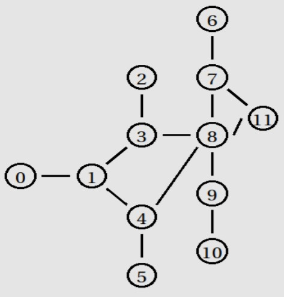

This simulation is for the following network:
	
	
	• Static Topology (same as figure) 
	• All links: 1Mb 10ms DropTail 
	• Dynamic Routing (DV) 
	• cbr over UDP: n10 −−> n2, Packet Size: 500 
	• cbr over UDP: n6 −−> n0, Packet Size: 500
	• vbr over UDP: n11 −−> n5, Rate: 600 Kb/s, Packet Size: 280, On/Off Exponential traffic burst_time_ 150ms, idle_time_ 100ms
	• Schedule Events: 
		o Down at 1. 5 : n3 −−> n8 (link failure) 
		o Down at 1. 8 : n4 −−> n8 (link failure) 
		o Up at 2. 2 : n3 −−> n8 
		o Up at 3. 2 : n4 −−> n8 
		o cbr n10 −−> n2: start at 0. 0, stop at 5. 0 
		o cbr n6 −−> n0: start at 0. 5, stop at 5. 0 
		o vbr n11 −−> n5: start at 0. 8, stop at 4. 0
Based on the out.tr file, the awk script is to show:
	• Total number of “ENQ” events 
	• The number of packets that n8 drops 
	• Total number of bytes that n3 receives 
	• Computation of the throughput of fid = 2

To run the code, enter the following commands:
	• ns proj.tcl
	• nam out.nam
	• awk –f script.awk out.tr
